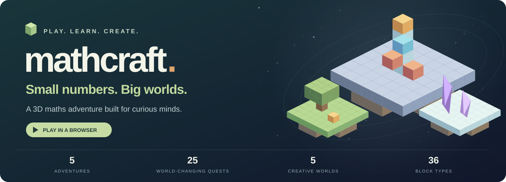
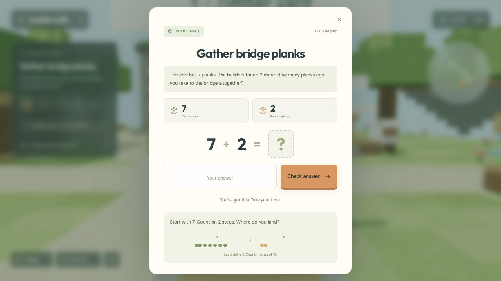
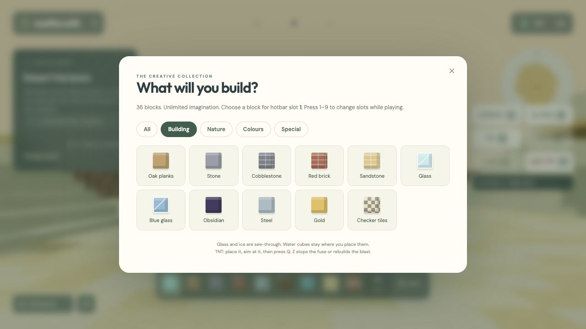
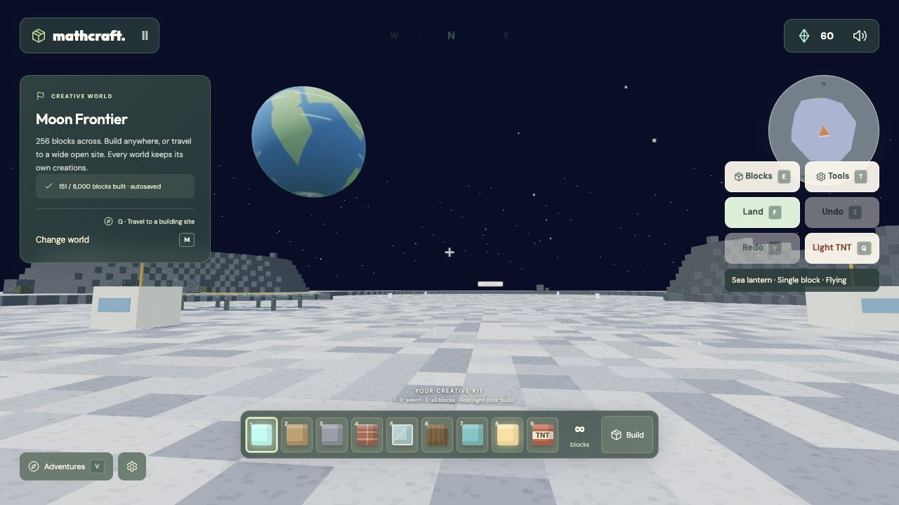
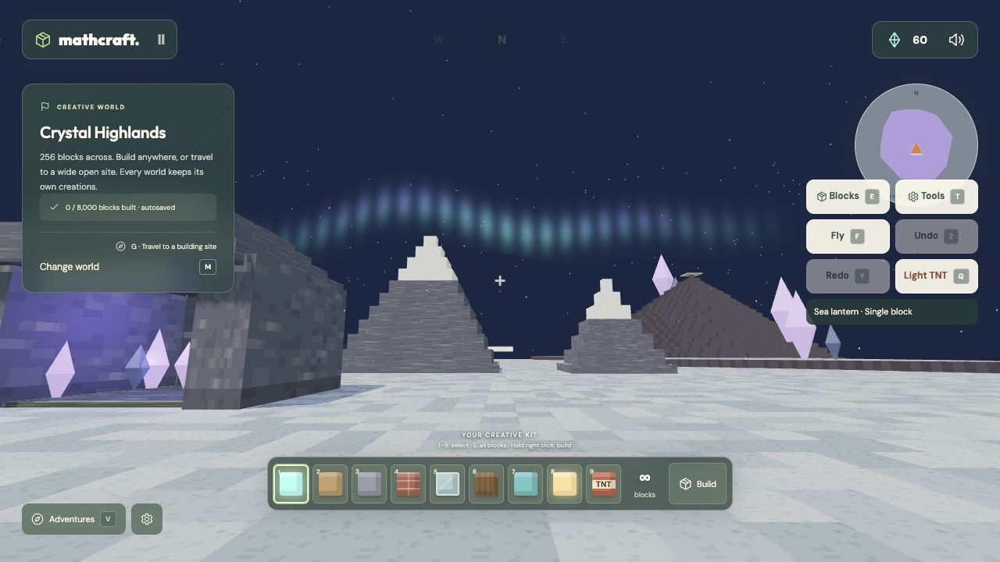
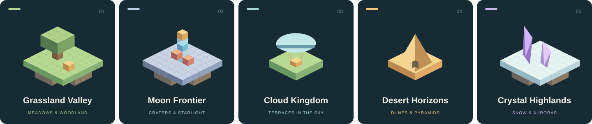

<p align="center">
  <a href="https://saveker.org/mathcraft/">
    
  </a>
</p>

<h1 align="center">Mathcraft — Number Islands</h1>

<p align="center">
  <strong>A little maths. A whole lot of possibility.</strong><br>
  Explore floating islands, bring extraordinary worlds to life, and build something of your own.
</p>

<p align="center">
  <a href="https://saveker.org/mathcraft/"><strong>Play Mathcraft →</strong></a>
  &nbsp; · &nbsp;
  <a href="docs/PLAYING.md">Player &amp; parent guide</a>
  &nbsp; · &nbsp;
  <a href="#run-locally">Run locally</a>
  &nbsp; · &nbsp;
  <a href="docs/DEVELOPMENT.md">Developer guide</a>
</p>

Mathcraft is a browser game made for children learning addition and subtraction. Inspired by the freedom of block-building games, it pairs familiar **WASD and mouse controls** with gentle maths practice and a generous creative sandbox. No timers, lost lives or accounts to create.

[](https://saveker.org/mathcraft/)

## Two ways to play

**Go on an adventure.** Use addition and subtraction to repair bridges, uncover fossils, send an airship into the sky and launch a lunar rocket. Five expeditions offer **25 distinct projects**. Every completed job visibly changes its world.

**Make a world your own.** Choose from five creative landscapes, fly to an open building site and start creating. Each world is roughly **256 blocks across**, with its own saved creations and room for **8,000 placed blocks**. All creative worlds are available from the start.

| Learn through play                           | Create without a materials budget                      |
| -------------------------------------------- | ------------------------------------------------------ |
| Addition and subtraction up to **100**       | **36 block types**, including glass, glowstone and TNT |
| Difficulty adjusts gradually for each skill  | Nine-slot hotbar, flight and fast travel               |
| Visual hints, counting dots and another try  | Single blocks, lines, walls and floors                 |
| Parent controls for range and operation      | Cottage, castle, tower and rocket blueprints           |
| Up to six explorers with individual progress | Undo, redo and chain-reaction explosions               |

## A look inside

These are actual gameplay captures. Open an image to see it at full size.

<table>
  <tr>
    <td width="50%"><a href="docs/images/maths-hints.jpg"></a><br><strong>Maths with a purpose</strong><br>Work out what the island needs, with help whenever it is needed.</td>
    <td width="50%"><a href="docs/images/block-library.jpg"></a><br><strong>A proper building kit</strong><br>Mix materials, colours and glowing blocks to make something personal.</td>
  </tr>
  <tr>
    <td width="50%"><a href="docs/images/moon-frontier.jpg"></a><br><strong>Moon Frontier</strong><br>Room for a moonbase beneath a sky full of stars.</td>
    <td width="50%"><a href="docs/images/crystal-highlands.jpg"></a><br><strong>Crystal Highlands</strong><br>Snowy peaks, glowing crystals and an animated aurora.</td>
  </tr>
</table>

## Five places to make your own

The creative worlds have distinct landscapes, five travel destinations apiece and independent saves. The original village lives on in Grassland Valley.



| Creative world        | Landscape                                               | Something to try                                 |
| --------------------- | ------------------------------------------------------- | ------------------------------------------------ |
| **Grassland Valley**  | Meadows, woodland groves and rolling hills              | A sprawling village or a castle in the woods     |
| **Moon Frontier**     | Lunar plains, crater rims and Earth overhead            | A moonbase, rocket hangar or rover garage        |
| **Cloud Kingdom**     | Broad terraces, drifting clouds and distant sky islands | An airship harbour or a kingdom above the clouds |
| **Desert Horizons**   | Dunes, mesas, pyramids and an oasis                     | A desert palace or a lost city                   |
| **Crystal Highlands** | Snowy ridges, giant crystals and northern lights        | An ice fortress or a glowing crystal city        |

The four outer travel sites each offer a clear **36 × 36 foundation**. The land beyond them is buildable too. Materials are unlimited; the 8,000-block save limit applies separately to each world and explorer.

<details>
<summary><strong>Explore the five maths expeditions</strong></summary>

| Expedition        | What you bring to life                                                        |
| ----------------- | ----------------------------------------------------------------------------- |
| **Meadow Isles**  | A timber yard, river bridge, flock of sheep, garden and ancient portal        |
| **Crystal Peaks** | An ice passage, moving minecart, summit lift, light prisms and rescue beacons |
| **Sunset Sands**  | A dinosaur fossil, reservoir, sun mosaic, treasure door and sand ship         |
| **Cloud Harbour** | Wind turbines, a balloon, postal glider, sky chimes and an airship            |
| **Moonbase Nova** | Solar panels, a six-wheeled rover, habitat, space antenna and rocket          |

Complete each expedition to unlock the next. Replays bring fresh questions, and unfinished adventures resume where you left them.

</details>

## Made for curious minds

- **A steady learning curve.** Addition and subtraction progress independently. New explorers begin with numbers up to 20, then work towards the parent-selected limit of 10, 20 or 100.
- **Support without pressure.** Hints explain counting on, counting back, and splitting tens and ones. Mistakes invite another attempt; answering speed is never measured.
- **A space for each child.** Up to six named explorers can choose a fox, astronaut, dragon or panda avatar. Each keeps their own progress, settings and buildings.
- **Saved as you play.** Progress lives in this browser on this device. There is no account or cross-device sync; clearing site data removes saves.

Read the [player and parent guide](docs/PLAYING.md) for learning settings, saves and the complete controls.

## Pick up the controls

| Control                | Action                                                               |
| ---------------------- | -------------------------------------------------------------------- |
| **WASD + mouse**       | Move and look around; drag to look when mouse capture is unavailable |
| **Space / Escape**     | Jump / pause                                                         |
| **E**                  | Interact in adventures; open the block library in creative worlds    |
| **G / M**              | Travel to a job or building site / change creative world             |
| **B / 1–9**            | Toggle building / select a creative hotbar slot                      |
| **Right / left click** | Place / mine player-built blocks                                     |
| **F / T**              | Toggle creative flight / choose building tools and blueprints        |
| **Q / Z / Y**          | Light TNT / undo / redo                                              |

Desktop offers the full keyboard-and-mouse experience. Touch controls are also available. TNT affects player-built blocks; terrain and scenery stay intact, and there is no player damage.

## Run locally

Use **Node.js 20.19+ or 22.12+** and a browser with **WebGL 2**.

```sh
git clone https://github.com/jsaveker/Mathcraft.git
cd Mathcraft
npm ci --include=dev
npm run dev
```

Open the URL Vite prints, usually `http://localhost:5173`.

```sh
npm test                 # Game logic, learning, saves, movement and creative tools
npm run format:check     # Source and documentation formatting
npm run build            # Static production build in dist/
npm run preview          # Preview the production build locally
```

## Built with

**Three.js · WebGL 2 · JavaScript · HTML/CSS · Vite**

The landscapes, textures, structures, avatars, effects and audio are generated in code. Instanced blocks and chunked terrain meshes keep the worlds efficient. The UI uses native HTML controls, and the game builds to a static site without a backend.

See the [developer guide](docs/DEVELOPMENT.md) for architecture, tests and publishing to Cloudflare Pages. The public source lives here; [saveker.org/mathcraft](https://saveker.org/mathcraft/) serves the built release through the separate Saveker website repository.

## Feedback

Found a bug or have an idea? [Open an issue](https://github.com/jsaveker/Mathcraft/issues). For bugs, include the browser, device, world and steps to reproduce. Please leave children's names and saved profile data out of public reports.

---

An independent project by [Jim Saveker](https://saveker.org). Mathcraft is inspired by block-building games and is not affiliated with Minecraft, Mojang or Microsoft. Fonts: Outfit and DM Sans, distributed through Fontsource under the SIL Open Font License. See the [asset notes](docs/images/README.md) for screenshot and illustration provenance.
